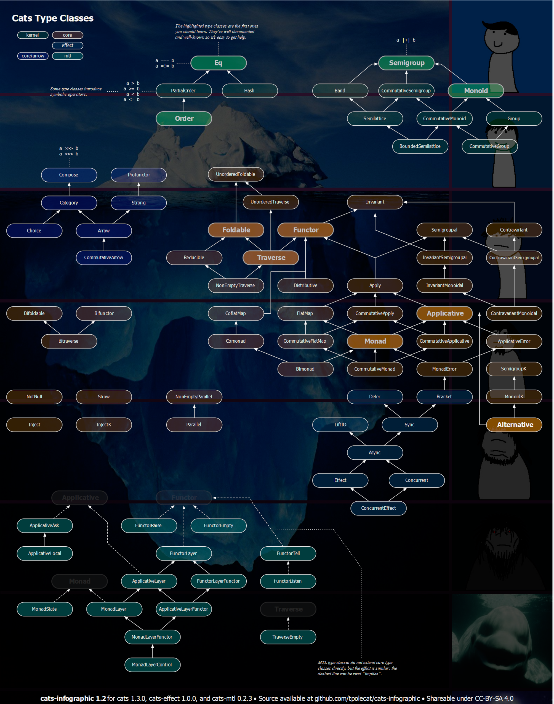

# pytypelevel

Typeclasses in pure python. Based upon Scala's [Cats](https://typelevel.org/cats/).

# Overview

What's currently implemented:

<b>Eq</b>

src: [pytypelevel.kernel.eq](pytypelevel/kernel/eq.py)

Docs forthcoming.

<b>Monoid</b>

src: [pytypelevel.kernel.monoid](pytypelevel/kernel/monoid.py)

Docs forthcoming.

<b>PartialOrder</b>

src: [pytypelevel.kernel.partial_order](pytypelevel/kernel/partial_order.py)

Docs forthcoming.

<b>Semigroup</b>

src: [pytypelevel.kernel.semigroup](pytypelevel/kernel/semigroup.py)

Docs forthcoming.

 

# Acknowledgements

Author(s):

- David Sillman <dsillman2000@gmail.com>